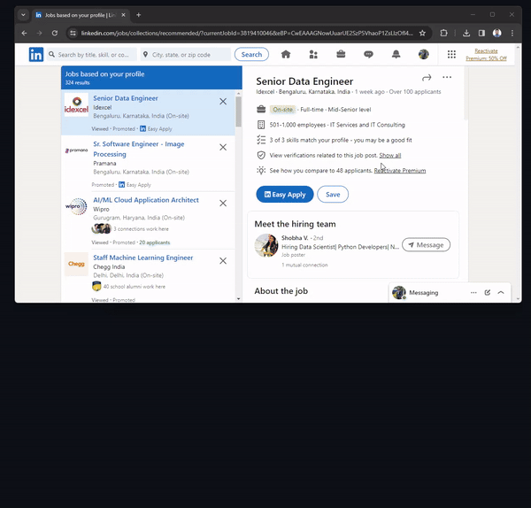

# Smart ATS



Smart ATS is a Streamlit application powered by Google's GenerativeAI that helps users improve their resumes by evaluating them against a provided job description. This intelligent tool acts as a skilled Application Tracking System (ATS), offering insights into matching percentages, missing keywords, and profile summaries.

## Features

- **Resume Evaluation:** Upload your resume in PDF format and paste the job description to receive an evaluation based on keyword matching and profile relevance.
  
- **Intelligent Analysis:** Smart ATS utilizes Google's GenerativeAI to deeply understand the tech field, including software engineering, data science, data analysis, and big data engineering, to provide accurate assessments.
  
- **Competitive Advantage:** In a highly competitive job market, Smart ATS assists users in optimizing their resumes by highlighting areas for improvement and suggesting relevant keywords.

## How to Use

1. **Paste the Job Description:** Copy and paste the job description into the provided text area.
  
2. **Upload Your Resume:** Upload your resume in PDF format using the file uploader.
  
3. **Submit:** Click the submit button to initiate the evaluation process.

## Example Response

Upon submission, Smart ATS generates a response in the following format:

```json
{
  "JD Match": "85%",
  "Missing Keywords": ["Python", "Machine Learning", "SQL"],
  "Profile Summary": "An experienced software engineer with expertise in JavaScript frameworks and cloud computing."
}
